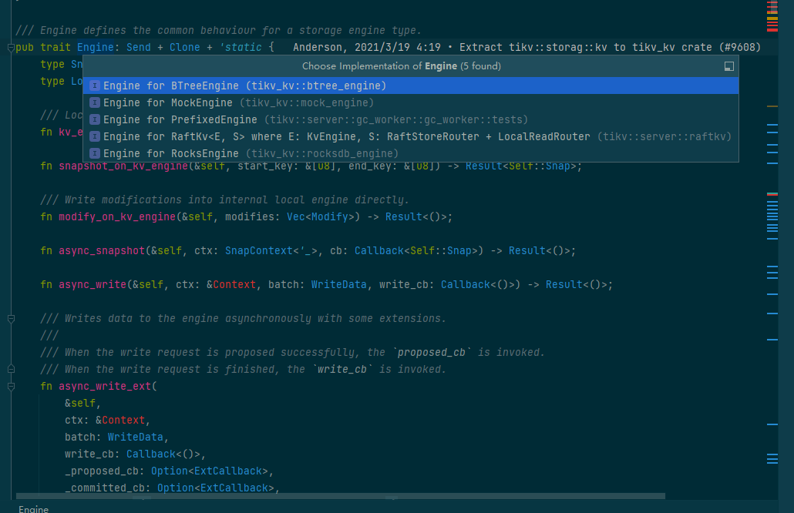

# TiDB

### Arch
```
    Service - Storage - TiKV - 底层存储引擎层  
                                  / | \
                            1. rocksdb_engine  
                            2. btree_engine
                            3. raftkv 
```



### TiKV
KV 操作分为 RawKV 和 TxnKV
RawKV包含raw put、raw get、raw delete、raw batch get、raw batch put、raw batch delete、raw scan等普通的KV操作,无事务控制
RxnKV是为了事务机制而设计的一系列操作

### TiKV源码剖析
```
    pub trait Engine: Send + Clone + 'static {
       type Snap: Snapshot;
       fn async_write(&self, ctx: &Contect, batch: Vec<Modify>, callback: Callback<()>) -> Result<()>;
       fn async_snapshot(&self, ctx: &Context, callback: Callback<Self::Snap>) -> Result<()>;
    }
    
    : 'static表示实现了Engine这个trait的struct的生命周期必须是'static类型的
    
    
    pub struct Storage<E: Engine, L: LockManager> {
        // TODO: Too many Arcs, would be slow when clone.
        // 底层的KV存储引擎
        engine: E,
    
        // 事务调度器，负责并发事务请求的调度工作
        sched: TxnScheduler<E, L>,
    
        // 所有只读KV请求，包括事务的和非事务的都会在这个线程池中执行
        read_pool: ReadPoolHandle,
    
        // 每个TiKV有一个gc_worker线程负责定期从PD更新safepoint，然后进行GC
        gc_worker: GCWorker<E>,
    
        // 是否支持悲观事务
        pessimistic_txn_enabled: bool,
    }
    对于只读请求，Storage调用所依赖的engine的async_snapshot获取数据库快照之后交给real_pool处理
    写入请求交给Scheduler进行处理
    
    /// A Snapshot is a consistent view of the underlying engine at a given point in time.
    ///
    /// Note that this is not an MVCC snapshot, that is a higher level abstraction of a view of TiKV
    /// at a specific timestamp. This snapshot is lower-level, a view of the underlying storage.
    pub trait Snapshot: Sync + Send + Clone {
        type Iter: Iterator;
    
        /// Get the value associated with `key` in default column family
        fn get(&self, key: &Key) -> Result<Option<Value>>;
    
        /// Get the value associated with `key` in `cf` column family
        fn get_cf(&self, cf: CfName, key: &Key) -> Result<Option<Value>>;
    
        /// Get the value associated with `key` in `cf` column family, with Options in `opts`
        fn get_cf_opt(&self, opts: ReadOptions, cf: CfName, key: &Key) -> Result<Option<Value>>;
        fn iter(&self, iter_opt: IterOptions) -> Result<Self::Iter>;
        fn iter_cf(&self, cf: CfName, iter_opt: IterOptions) -> Result<Self::Iter>;
        // The minimum key this snapshot can retrieve.
        #[inline]
        fn lower_bound(&self) -> Option<&[u8]> {
            None
        }
        // The maximum key can be fetched from the snapshot should less than the upper bound.
        #[inline]
        fn upper_bound(&self) -> Option<&[u8]> {
            None
        }
    
        /// Retrieves a version that represents the modification status of the underlying data.
        /// Version should be changed when underlying data is changed.
        ///
        /// If the engine does not support data version, then `None` is returned.
        #[inline]
        fn get_data_version(&self) -> Option<u64> {
            None
        }
    
        fn is_max_ts_synced(&self) -> bool {
            // If the snapshot does not come from a multi-raft engine, max ts
            // needn't be updated.
            true
        }
    }
    
    #[derive(Clone)]
    struct Latch {
        pub waiting: VecDeque<u64>,
    }
```
### TiKV GC
1. TiDB的事务使用  MVCC  机制，这里的GC不是去清理分配的内存，是去处理不再需要的旧数据
2. TIDB GC执行流程
     1. Resolve Locks 移除safe point之前的锁
     2. Delete Ranges （快速地删除由于 DROP TABLE/DROP INDEX 等操作产生的整区间的废弃数据）
     3. Do GC 每隔TiKV节点扫描自己节点上的数据，这一步即删除所有 key 的过期版本
3. 默认情况下 TiKV GC每10分钟执行一次，


### TiDB正在完善的地方
1. 当使用的底层存储引擎为raft_engine的时候，会从replica里面获取一个版本，然后检查此版本是不是raft leader的版本，
raft_engine只支持从leader进行读操作，follower的read目前在TiKV最新版本中还不支持
2. 