# Collector问题想法
1. 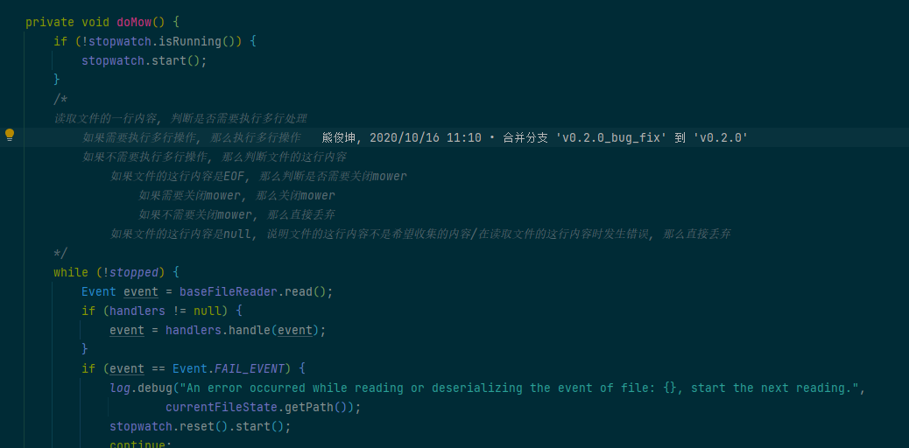
2. 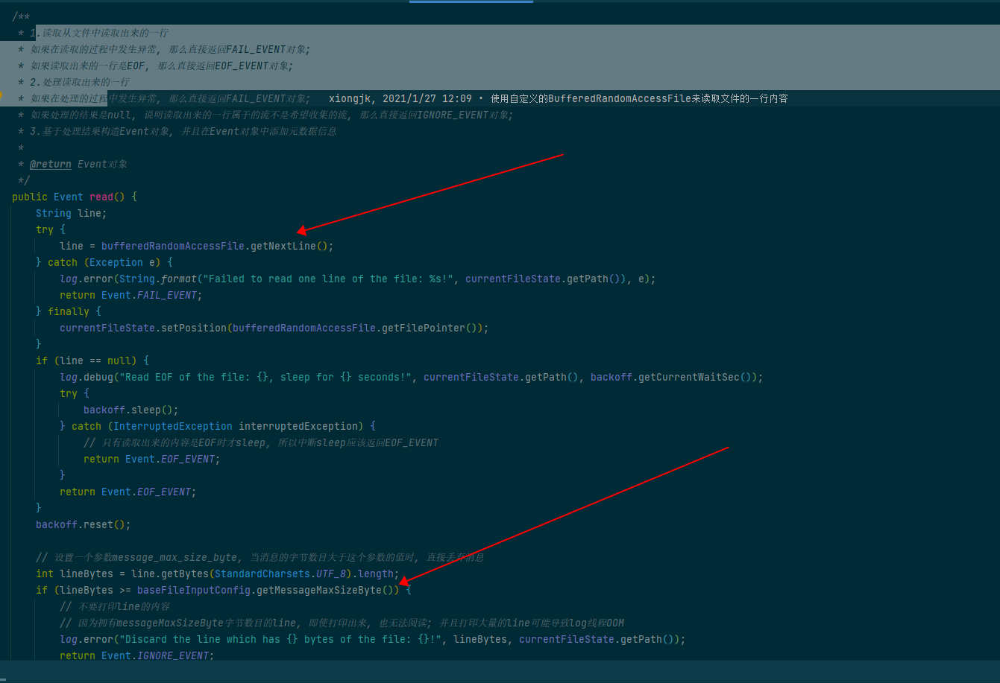
3. 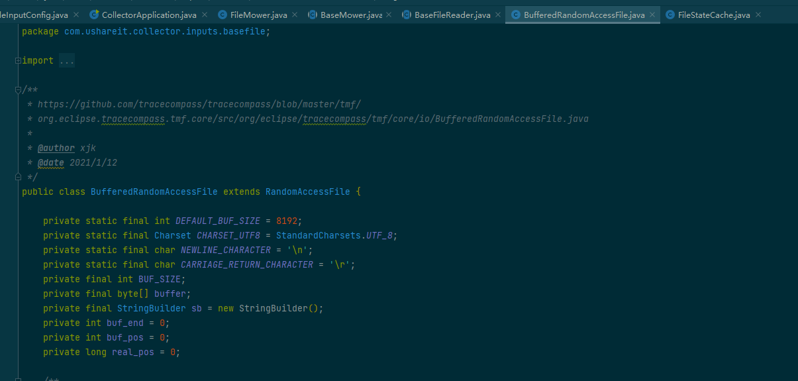
4. 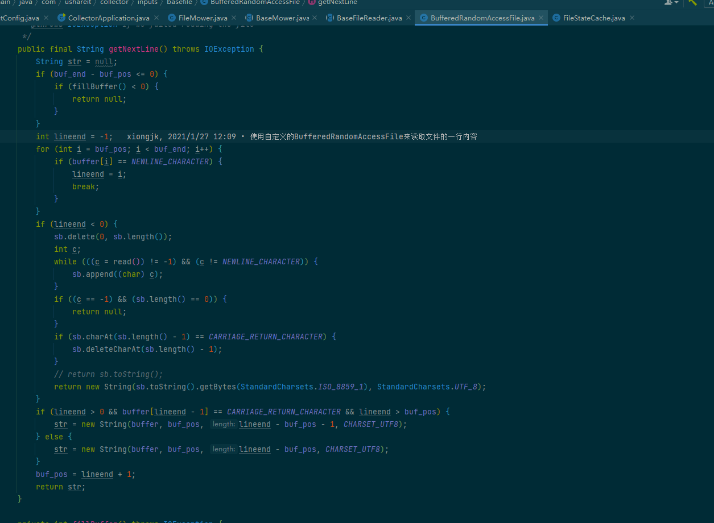


# Python项目总结
# 目前项目
1. 脚本单独去执行   

#### Source: 
* Amazon Athena
* agora
* huaweicloud
* fengkongcloud
* tencentcloud
* amazon aws

## 模块划分

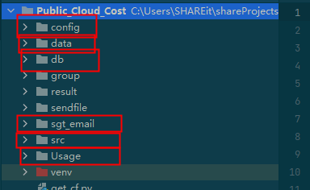
* Usage Module  获取使用数据情况模块
  1. (定时)获取数据
    请求时的signature构建过程
    *. let result = 使用hmac库用sha1根据sk和具体的消息内容取hash并取摘要digest
    *. base64 urlsafe_b64encode(result).decode()
  2. 数据清理
  3. 数据落库
* src Module 处理数据并生成相关报告，比如dataFrame图像写入到excel中
* sgt_email Module 负责给对应人员发邮件的模块
* db Module 数据库处理相关模块
* data Module 获取具体花销的模块
* config Module 配置相关模块


#### 所使用的服务

##### Arch
```
    Service - Storage - TiKV - 底层存储引擎层  
                                  / | \
                            1. rocksdb_engine  
                            2. btree_engine
                            3. raftkv 
```

1. TiDB
   全新的一栈式实时 HTAP (Hybrid Transactional/Analytical Processing)数据库
   特点:
      * 基于分布式架构，支持弹性扩容，可按需扩展吞吐或存储，便于应对高并发
      * 内部通讯框架采用gRPC  https://grpc.io/   其依赖ProtoBuf序列化协议
      * 内部监控系统采用prometheus
      * 参考了Google Spanner和F1的设计，F1建立在Spanner之上     
           * F1 Goal
             1. 无需应用程序更改即可重新分片和重新平衡
             2. ACID 
           * Spanner Goal
             1. 管理跨数据中心复制的数据
             2. 重新分片和重新平衡数据
             3. 自动跨机器迁移数据
      * TiDB使用Raft一致性协议来同步数据，对于异地多活的场景比较好
      * TiDB提供完整的分布式事务   基于google precolator
        1. 乐观事务
        2. 悲观事务  默认采用这个
        3. 事务大小限制
        4. 事务隔离级别采用可重复读
      * Snapshot机制
         1. 新增follower从leader使用snapshot拉取数据  
         2. 备份时 dump数据此时需要snapshot
         3. 因为其数据量可能会比较大，为snapshot创建单独的网络连接，并将snapshot拆分成多个1M大小的chunk进行传输
         4. 快照首先会被包装成RaftMessage之后snap-worker发送raftMessage其中只包含snapshot的元信息，真正的快照数据在SnapManager来进行发送
         5. ```
                fn send_snap(
                        ...
                        addr: &str,
                        msg: RaftMessage,
                        ) -> Result<impl Future<Item = SendStat, Error = Error>> {
                        ...
                        let key = {
                        let snap = msg.get_message().get_snapshot();
                        SnapKey::from_snap(snap)?
                        };
                        ...
                        let s = box_try!(mgr.get_snapshot_for_sending(&key));
                        if !s.exists() {
                        return Err(box_err!("missing snap file: {:?}", s.path()));
                        }
                        let total_size = s.total_size()?;
                        let chunks = {
                        let mut first_chunk = SnapshotChunk::new();
                        first_chunk.set_message(msg);
                        
                              SnapChunk {
                                  first: Some(first_chunk),
                                  snap: s,
                                  remain_bytes: total_size as usize,
                              }
                        };
                        
                        let cb = ChannelBuilder::new(env);
                        let channel = security_mgr.connect(cb, addr);
                        let client = TikvClient::new(channel);
                        let (sink, receiver) = client.snapshot()?;
                        
                        let send = chunks.forward(sink).map_err(Error::from);
                        let send = send
                        .and_then(|(s, _)| receiver.map_err(Error::from).map(|_| s))
                        .then(move |result| {
                        ...
                        });
                        Ok(send)
                        }
            ```
      * TiDB架构分析  上层分为TiDB和TiKV，TiDB对应的是Google F1，是一层无状态的SQL Layer，
        兼容绝大多数MySQL语法，对外暴露Mysql协议，负责解析用户的SQL语句，生成分布式的QueryPlan，
        翻译成底层Key Value操作发送给TiKV，TiKV是真正存储数据的地方，对应的是Google Spanner，
        TiKV是一个分布式Key Value数据库，支持弹性水平扩展，自动的灾难恢复和故障转移以及ACID跨行事务。
        TiKV不像是HBase和BigTable依赖底层的分布式系统，在灵活性上更好
        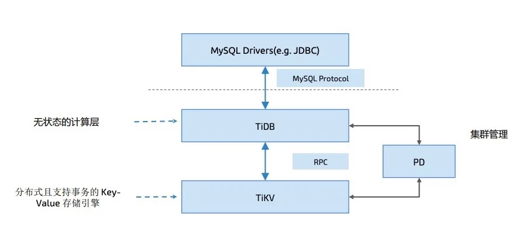
        1. TiDB Server负责接受SQL请求，处理Sql相关的逻辑，并通过PD找到存储计算所需数据的TiKV地址，
           与TiKV交互获取数据，最终返回结果。TiDB Server是无状态的，其本身不存储数据，只负责计算，
           可以水平扩展
        2. PD(Placement Driver) Server是整个集群的管理模块，一是负责存储集群的元信息，某个Key存储在那个TiKV节点上，
           二是对TiKV集群进行调度和负载均衡，比如数据的迁移和raft group leader的迁移  三是分配全局唯一且递增的事务id
           PD是一个集群需要部署奇数个节点，一般线上至少部署三个
        3. TiKV server底层依赖于RocksDB，Facebook开源的单机KV存储引擎，负责存储数据，从外部看是一个分布式的提供事务的key value存储引擎，
           存储数据的基本单位是Region，每个region负责存储一个key range，每个TiKV节点负责多个Region，TiKV使用Raft协议做复制，保证数据的
           一致性和容灾，副本以region为单位进行管理，不同节点上多个region构成一个raft group，互为副本，数据在多个TiKV之间的负载由PD调度，
           以Region为单位进行调度。通过raft，TikV变成了一个分布式的Key-Value存储，少数几台机器宕机也能通过原生的Raft协议自动把副本补全，
           可以做到业务无感知。每一段region的最大大小设置为96MB。以region为单位做Raft的复制和成员管理。
        4. TiKV以region为单位做数据的复制，也就是一个Region的数据会保存为多个副本，每一个副本叫做一个replica，replica之间通过raft来保持
           数据的一致，一个region的多个replica会保存在不同的节点上，构成一个raft group，其中一个replica会作为这个group的leader，其他的
           replica会作为follower，默认情况所有的读和写都是通过leader进行，写操作从leader上写完再复制给follower
           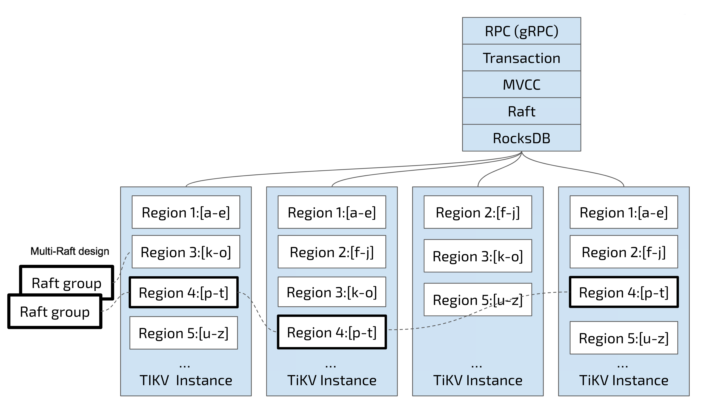
           该种设计结构使其具备了容灾能力
        5. TikV通过在key后面添加版本号实现MVCC
        6. TiKV事务采用的是Google在BigTable中使用的实物模型 Percolator
           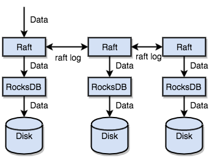  
        7. RocksDB：提供键值存储与读写功能的LSM-tree(Log Structured Merge Tree)架构引擎，用户写入的键值会先写入磁盘上的WAL(write ahead log),然后再写入内存中的跳表，
           在RocksDB中该跳表称之为MemTable，这里和赵盼之前分享的时序数据库用的同一结构LSM-Tree
           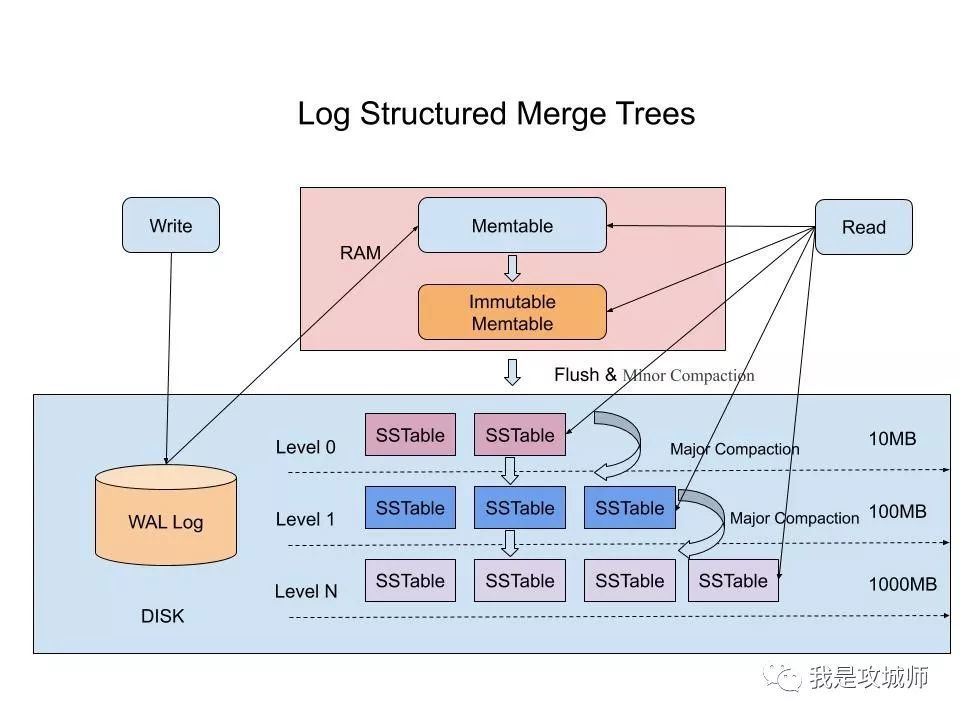
        8. 内部存储引擎分为TiKV和TiFlash
           这两者具体区别
           TiFlash是TiDB对于AP(Analytical Processing)扩展,通过Raft Learner协议，从TiKV同步传过来的
           TiFlash与TiKV的最大区别，TiFlash借助ClickHouse向量化引擎，采用向量化存储，在计算上继承了它高性能的优点
           TiKV则是列式存储，数据写入慢，但是比较适合OLAP系统，读其中某一列的数据相当于
        9. TiDB Engine
        ```
        pub trait Engine: Send + Clone + 'static {
             type Snap: Snapshot;
             fn async_write(&self, ctx: &Contect, batch: Vec<Modify>, callback: Callback<()>) -> Result<()>;
             fn async_snapshot(&self, ctx: &Context, callback: Callback<Self::Snap>) -> Result<()>;
        }
        ```
        实现了上述Engine Trait都可以作为TiKV的底层存储引擎，目前现在包含Rocksdb_engine,btree_engine,raftkv
        目前默认使用的是RaftKV引擎，这里的async_write成功之后意味着raft协议下的write已经完成
        ``` 
          impl<E: Engine> Storage<E> {
               pub fn async_raw_put(
                 &self,
                 ctx: Context,
                 cf: String,
                 key: Vec<u8>,
                  value: Vec<u8>,
                  callback: Callback<()>,
                ) -> Result<()> {
               // Omit some limit checks about key and value here...
               self.engine.async_write(
               &ctx,
               vec![Modify::Put(
                   Self::rawkv_cf(&cf),
                   Key::from_encoded(key),
                   value,
               )],
               Box::new(|(_, res)| callback(res.map_err(Error::from))),
               )?;
               Ok(())
               }
          }
        ```
   性能对比:
      TPC-H衡量OLAP(online analytical processing)的性能    
      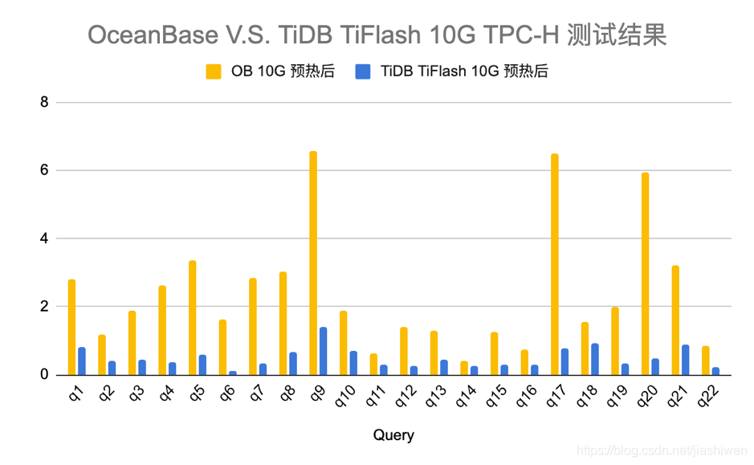  
   
2. pandas::DateFrame
   数据可视化存储到excel中
   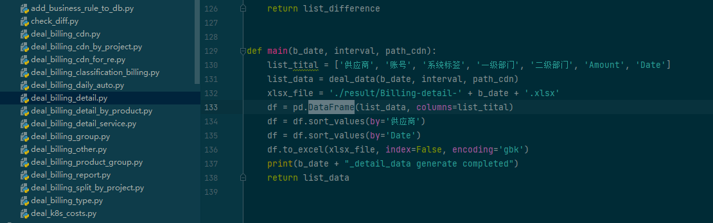
3. boto amazon service client
 
### 目前可优化的地方
1可以将更多的配置相关抽到配置文件中，而不是硬编码在代码里，更直观些且便于维护  
 ---
 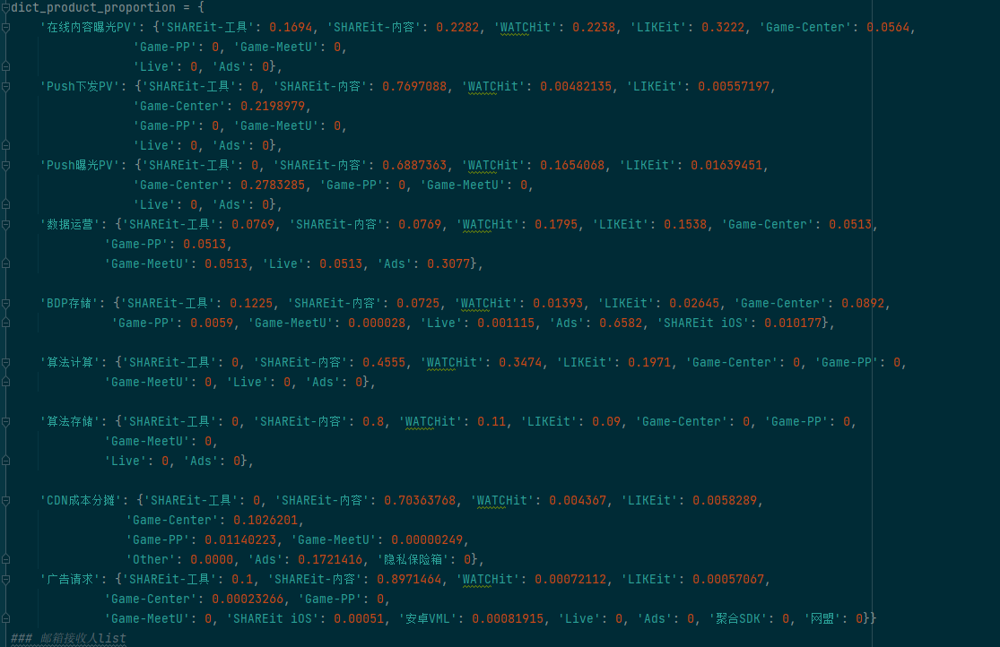
 ---
 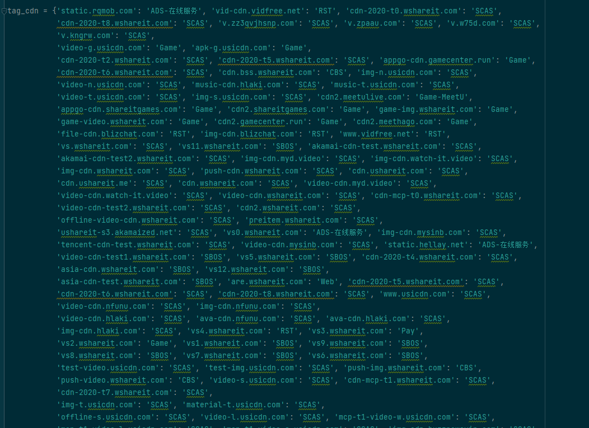
2.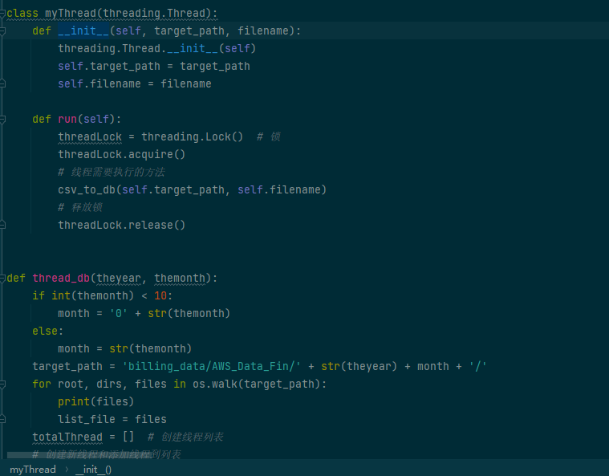
   * 使用python协程替代线程执行io式任务
   * Class名和方法名可以进一步改善
3.不同脚本之间api目前是通过main来进行调用
4.整个项目可以更加工程化一些

#### 使用想法
1. jython调用对应的python代码获取对应的数据
2. 通过django或者flask将数据提供给新工程
3. 在现有python的基础上做成一套健壮的服务
4. 

# 对于可观测平台和成本平台的想法


### TiKV
KV 操作分为 RawKV 和 TxnKV
RawKV包含raw put、raw get、raw delete、raw batch get、raw batch put、raw batch delete、raw scan等普通的KV操作,无事务控制
RxnKV是为了事务机制而设计的一系列操作

### TiKV源码剖析
```
    pub trait Engine: Send + Clone + 'static {
       type Snap: Snapshot;
       fn async_write(&self, ctx: &Contect, batch: Vec<Modify>, callback: Callback<()>) -> Result<()>;
       fn async_snapshot(&self, ctx: &Context, callback: Callback<Self::Snap>) -> Result<()>;
    }
    
    : 'static表示实现了Engine这个trait的struct的生命周期必须是'static类型的
    
    
    pub struct Storage<E: Engine, L: LockManager> {
        // TODO: Too many Arcs, would be slow when clone.
        // 底层的KV存储引擎
        engine: E,
    
        // 事务调度器，负责并发事务请求的调度工作
        sched: TxnScheduler<E, L>,
    
        // 所有只读KV请求，包括事务的和非事务的都会在这个线程池中执行
        read_pool: ReadPoolHandle,
    
        // 每个TiKV有一个gc_worker线程负责定期从PD更新safepoint，然后进行GC
        gc_worker: GCWorker<E>,
    
        // 是否支持悲观事务
        pessimistic_txn_enabled: bool,
    }
    对于只读请求，Storage调用所依赖的engine的async_snapshot获取数据库快照之后交给real_pool处理
    写入请求交给Scheduler进行处理
    
    /// A Snapshot is a consistent view of the underlying engine at a given point in time.
    ///
    /// Note that this is not an MVCC snapshot, that is a higher level abstraction of a view of TiKV
    /// at a specific timestamp. This snapshot is lower-level, a view of the underlying storage.
    pub trait Snapshot: Sync + Send + Clone {
        type Iter: Iterator;
    
        /// Get the value associated with `key` in default column family
        fn get(&self, key: &Key) -> Result<Option<Value>>;
    
        /// Get the value associated with `key` in `cf` column family
        fn get_cf(&self, cf: CfName, key: &Key) -> Result<Option<Value>>;
    
        /// Get the value associated with `key` in `cf` column family, with Options in `opts`
        fn get_cf_opt(&self, opts: ReadOptions, cf: CfName, key: &Key) -> Result<Option<Value>>;
        fn iter(&self, iter_opt: IterOptions) -> Result<Self::Iter>;
        fn iter_cf(&self, cf: CfName, iter_opt: IterOptions) -> Result<Self::Iter>;
        // The minimum key this snapshot can retrieve.
        #[inline]
        fn lower_bound(&self) -> Option<&[u8]> {
            None
        }
        // The maximum key can be fetched from the snapshot should less than the upper bound.
        #[inline]
        fn upper_bound(&self) -> Option<&[u8]> {
            None
        }
    
        /// Retrieves a version that represents the modification status of the underlying data.
        /// Version should be changed when underlying data is changed.
        ///
        /// If the engine does not support data version, then `None` is returned.
        #[inline]
        fn get_data_version(&self) -> Option<u64> {
            None
        }
    
        fn is_max_ts_synced(&self) -> bool {
            // If the snapshot does not come from a multi-raft engine, max ts
            // needn't be updated.
            true
        }
    }
    
    #[derive(Clone)]
    struct Latch {
        pub waiting: VecDeque<u64>,
    }
```
### TiKV GC
1. TiDB的事务使用  MVCC  机制，这里的GC不是去清理分配的内存，是去处理不再需要的旧数据
2. TIDB GC执行流程
    1. Resolve Locks 移除safe point之前的锁
    2. Delete Ranges （快速地删除由于 DROP TABLE/DROP INDEX 等操作产生的整区间的废弃数据）
    3. Do GC 每隔TiKV节点扫描自己节点上的数据，这一步即删除所有 key 的过期版本
3. 默认情况下 TiKV GC每10分钟执行一次，


### TiDB正在完善的地方
1. 当使用的底层存储引擎为raft_engine的时候，会从replica里面获取一个版本，然后检查此版本是不是raft leader的版本，
   raft_engine只支持从leader进行读操作，follower的read目前在TiKV最新版本中还不支持
2. 