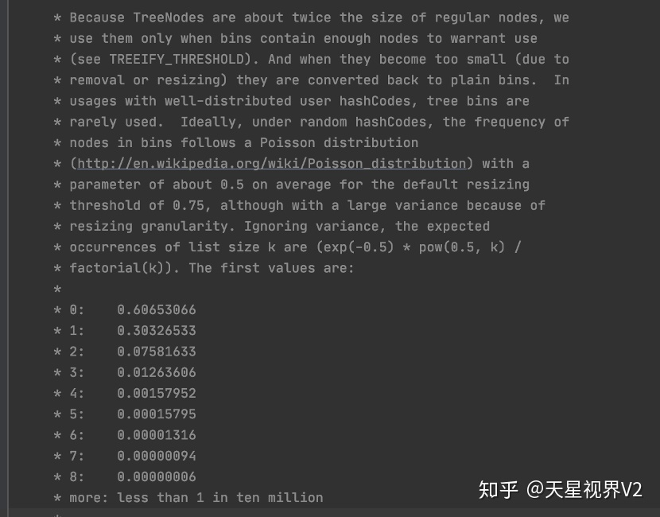

# Detail:
1. 为何链表转红黑树的时候长度选择8？  
     
   从源码说明看链表长度符合柏松分布，如下所示: 显示链表长度k的概率分布
   链表长度达到8的概率已经非常低，综合考虑转换为红黑树的性能和链表查询性能，只有在极端情况下才进行转换，大部分情况下链表都不长。
2. 网络字节序，Java Class文件使用了网络字节序，为了在小端字节序intel x86和大端字节序risc之间维持平台独立性，必须保证固定的字节顺序。
   因此，jvm使用了用于网络传输的网络字节序，网络字节序属于大端。
   大小端字节序相关文章 https://www.ruanyifeng.com/blog/2016/11/byte-order.html
3. zero cost abstraction零开销抽象指的是你在构建一个抽象的时候，这个抽象不会造成额外的负担，典型的对比是struct和Java的class，如果java的类A有类B的成员，
   那么通过这个A类对象访问B成员事实上需要两次指针访问，但如果是rust的struct，你直接把它分配到栈上，那直接可以访问到了，
   虽然我们做出了抽象，但是并没有为抽象支付成本，和你不抽象直接把东西放一起是一样的。
4. Rust  usize是指该平台上理论上内存对象的最大大小，一般就是指指针能表示的地址空间，是一个与程序位数，平台都相关的类型，Rust中各种迭代都是推荐用usize的，比C++要统一
   官方直接要求使用usize，且不允许隐式转换。
   如果是u32在64位平台就没法覆盖全部寻址空间，u64在32位平台就需要将一条指令的事情转换为两条指令
5. rt.jar代表runtime JAR，并且包含引导类（bootstrap classes）——来自Core Java API的所有类。
6. [question mark operator and unwrap](https://m4rw3r.github.io/rust-questionmark-operator)
   1. ?操作符要求方法返回值要是Result才可以   unwrap()不需要对方法返回值做限定  遇到问题直接会调用panic!()进行抛出异常
7. The function syntax (Rc::clone(&rc)) makes it clear you're only making a new shared reference (cheap), 
   rather than cloning the underlying object being referenced (maybe expensive). 
   For arbitrary reference counted types, it may not be clear if a shallow or deep copy is occurring.
8. 

## Not Important:
1. 当filter条件为false过滤此元素，而true则保留此元素。
2. 